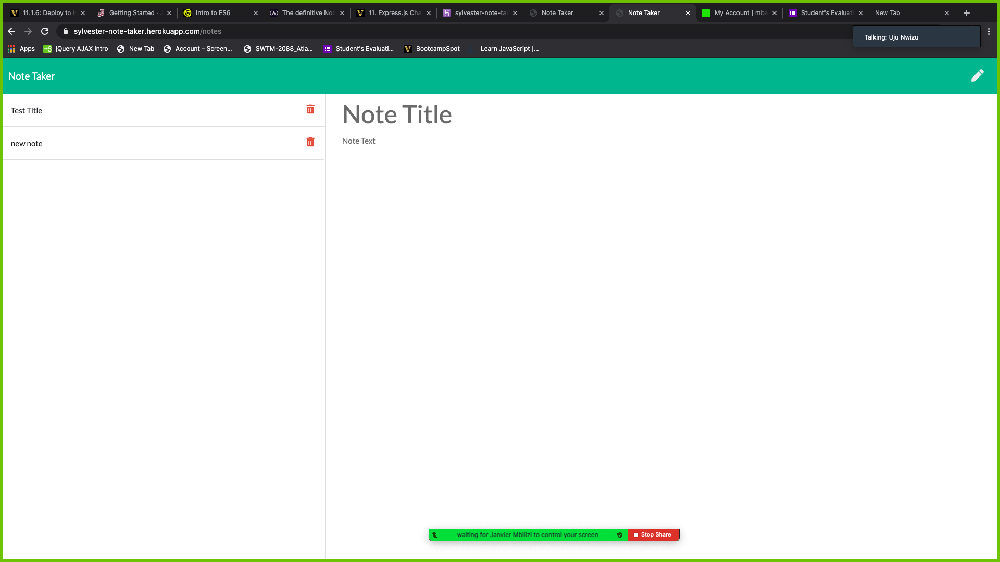

# Note Taker
<strong>Note Taker</strong>

The name of this application is <i>Note Taker</i> it is designed to use for writing, saving, and deleting notes. This application  uses an Express.js back end and saves and retrieves note data from a JSON file.

<strong>Image</strong>

<strong>Description</strong>
This project is aimed at developing an application that will help people in taking and saving and deleting notes. 
<strong>Technology used</strong>
In building this app, I used HTML, CSS and Javascript . 

<strong>Installation</strong>

This project does not need any installation,rather it is currently hosted on Heroku, which can be accessed using by clicking on the link below 
https://sylvester-note-taker.herokuapp.com/notes
<strong>Usage</strong>

The page is simple, clean, and easy to use and undertand. It allows the user to be able to apply the acronym CRUD, which stands for create, read, update, and delete. 

<strong>Support and Contribution</strong>
If you have any question or want to see our Repo, please email me at nwizutoks@gmail.com
